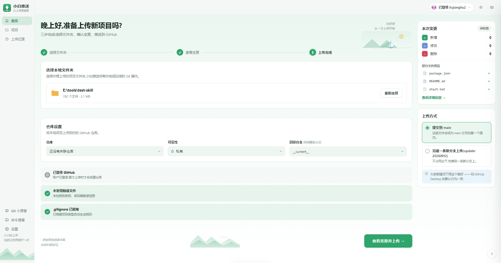
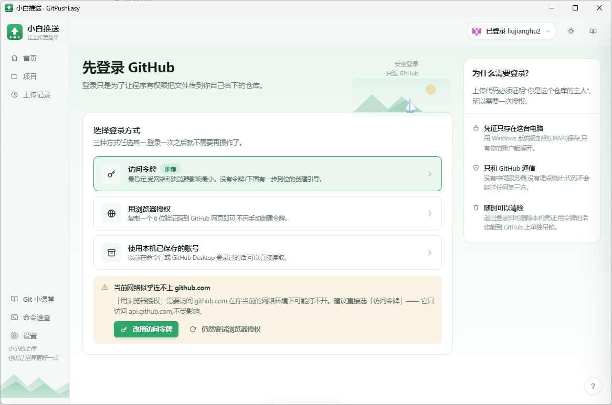
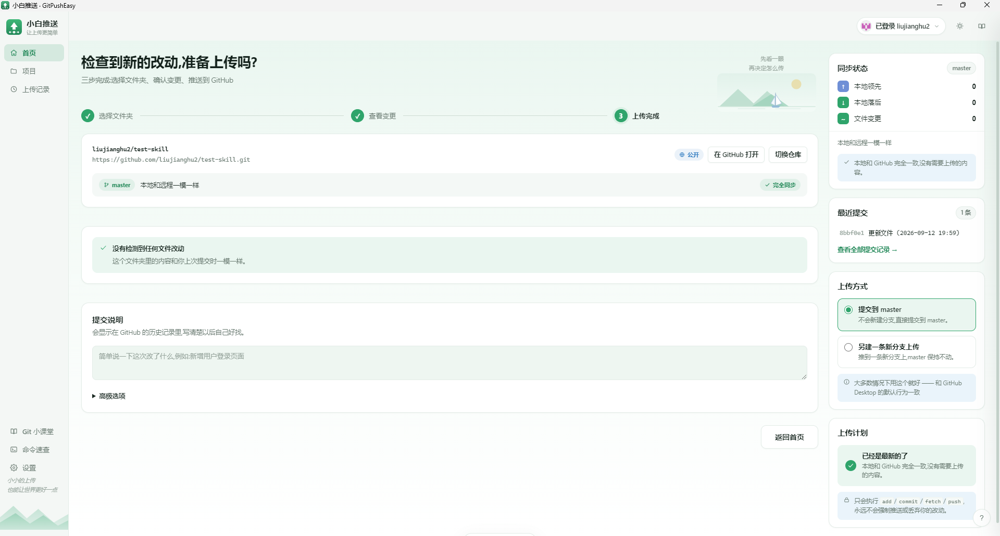
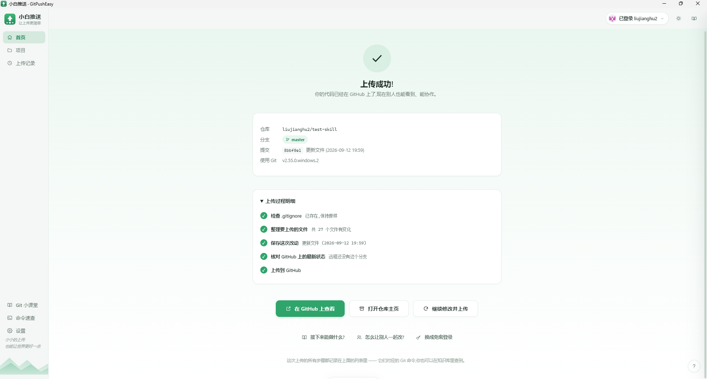
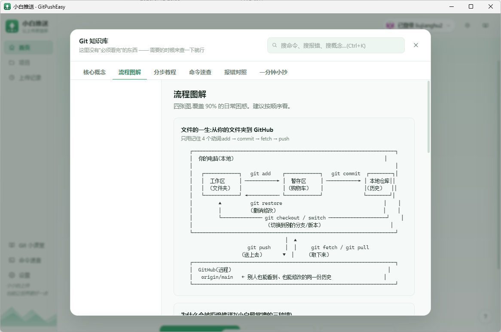

# 小白推送 · GitPushEasy

> 把本地文件夹一键传上 GitHub 的桌面小工具。
> 中文界面,左侧导航 + 三步走完:选择文件夹 → 查看变更 → 上传完成。

---

## 界面

```

```

- **左侧导航**:首页 / 项目 / 上传记录,下方是 Git 小课堂、命令速查、设置,底部有山峦插画与寄语
- **中间主区**:问候语 + 右上角小插画 + 三步流程条 + 表单卡片,主操作按钮固定在内容底部
- **右侧面板**:随当前步骤变化 —— 选文件夹时显示变更统计与上传方式;查看变更时显示同步状态、最近提交
- **亮 / 暗两套主题**,默认亮色,顶栏 ☀️/🌙 一键切换

---

## 这是什么

一个**给不熟悉 Git 命令行的人**用的 GitHub 上传工具。

你知道官方有 GitHub Desktop、VS Code 的 Git 面板,它们都很好。
这个小工具的目标不是取代它们,而是**把"上传"这一件事做到最直白**:

| 你可能遇到的困惑 | 这个工具怎么处理 |
|---|---|
| 命令行太吓人,一堆英文报错看不懂 | 全中文界面,报错翻译成"人话"并给出下一步 |
| 不知道 `git add` / `commit` / `push` 到底谁先谁后 | 不用管,程序按正确顺序自动执行,并在旁边把每步显示出来 |
| 推送被拒了(`non-fast-forward`)完全不知道怎么办 | 自动检测到,并给出两个安全选项:先同步再上传 / 新建分支上传 |
| 怕把 `node_modules`、`.env` 密钥传上去 | 自动生成 `.gitignore`,并在上传前明确列出会传/不会传什么 |
| 不小心把整个 C 盘选进去了 | 识别系统目录并阻止,给出明确警告 |
| 想让别人也能改,但不会开分支、发 PR | 界面上有"新建分支上传"和 Pull Request 引导 |
| 想学 Git 但教程太长 | 内置一个完整的知识库(概念/流程图/8 节课/116 条命令/报错对照) |

**它是一个诚实的小工具**:底层调用的是你电脑上真正的 `git` 命令,
做的事情和你手敲命令完全一样。学完之后你随时可以扔掉它。

---

## 快速开始

### 方式一:安装版(推荐)

1. 下载 `GitPushEasy-1.0.0-安装程序.exe`
2. 双击,一路"下一步"(可以改安装位置)
3. 桌面会出现 **小白推送** 图标,双击打开

### 方式二:绿色版(不安装)

1. 下载 `GitPushEasy-1.0.0-绿色版.exe`
2. 放到任意位置,**双击即用**,不写注册表、不建快捷方式
   (适合放 U 盘里随身带)

### 前提条件:电脑上要有 Git

程序依赖官方的 **Git for Windows**(这是最可靠的推送方式,也保证和你以后
在命令行里的行为完全一致)。

- 如果没装,程序启动后会**直接检测到并给出下载按钮**,不会让你走到一半才失败
- 下载地址:https://git-scm.com/download/win ,一路默认安装即可

> 为什么不自带 Git?因为完整自带会让安装包从 ~90MB 涨到 ~250MB,
> 而绝大多数开发者的电脑上本来就有 Git。

---

## 使用流程

### 第 1 步:登录 GitHub

点右上角"登录 GitHub"药丸进入登录页。点任意一种方式会打开一个独立弹窗完成整个流程


| 方式 | 适合谁 | 说明 |
|---|---|---|
| **访问令牌 (PAT)** | 所有人(最稳,首选) | 界面上有"一键创建令牌"的引导,已经帮你勾好权限,1 分钟搞定,**不需要任何额外配置** |
| **浏览器授权** | 想最省事的人 | 点一下 → 复制 6 位验证码 → 在打开的网页里粘贴 → 自动完成。**需要先准备一个自己的 Client ID**(见下) |
| **本机已保存的账号** | 以前用过命令行 / GitHub Desktop | 从 Windows 凭据管理器读取,一键登录 |

登录凭证使用 **Windows 系统级加密(DPAPI)** 保存在你自己电脑上,
只有你的 Windows 账户能解开。随时可以在设置里删除。

#### 关于"浏览器授权"需要的 Client ID

GitHub 规定 **Device Flow 必须由某个 OAuth App 发起**,而每个 OAuth App 都归属于
一个具体账号 —— **GitHub 没有"公共 Client ID"可以借用**。所以这条路必须先准备
一个自己的 Client ID(免费,约 1 分钟,只需做一次):

1. 打开 [OAuth Apps 页面](https://github.com/settings/developers),点 **New OAuth App**
2. Application name 填「小白推送」,Homepage URL 填 `https://github.com`(其余保持默认)
3. 进入刚创建的应用,**勾选 Enable Device Flow** 并保存 ← 这一步最关键
4. 复制页面顶部的 **Client ID**(注意别复制成 Client Secret),粘贴回本程序

程序把这一整套做成了**内嵌引导**:在"浏览器授权"弹窗里直接有跳转按钮、
可一键复制的表单值、粘贴框,以及**「校验并保存」** —— 粘贴后会立刻向 GitHub
验证这个 ID 能不能用,并针对失败原因(不存在 / 未开启 Device Flow / 格式不对 /
网络不通)给出具体下一步,不用等到真正登录时才发现问题。

> 如果不想做这一步,直接用**访问令牌**即可 —— 效果完全一样,而且零配置。
> 另外:如果当前网络连不上 `github.com`(国内较常见,`api.github.com` 往往能通),
> 浏览器授权也会失败。程序会在登录页**提前探测并提示**,建议改用访问令牌或开启代理。

### 第 2 步:选择文件夹(首页)

- 点击"浏览文件夹",或**直接把文件夹拖进窗口任意位置**
- 程序会先做一次"体检"并展示:**文件数量 / 总体积 / 项目类型 / 是否已是 Git 仓库**
- 如果还没用过 Git,会自动生成一份适合你项目类型的 `.gitignore`
  (Node / Python / Java / Unity / 通用),排除依赖、构建产物和密钥文件
- 如果误选了 C 盘根目录、用户主目录或 Windows 系统目录,会**直接阻止并说明原因**
- 发现超过 100MB 的文件会提前警告(GitHub 的硬限制,传了必失败)

同时在**仓库设置**里可以直接选好三个关键项:

- **仓库** —— 当前关联的仓库,或从最近用过的仓库里切换,或"新建仓库 / 选择其它"
- **可见性** —— 私有 / 公开(新建仓库时生效,默认私有)
- **目标分支** —— 默认 `main`,若仓库已有其它分支也会列出来

右侧面板实时显示**本次变更统计**(新增/修改/删除)、部分文件预览,以及**上传方式**。

### 第 3 步:查看变更并上传

这是最核心的一屏。它会把"现在什么情况"讲清楚,然后给出**一个推荐动作**:

- **完全同步** → 告诉你"已经是最新的了",不用做任何事
- **本地有改动** → "提交并上传",并列出所有变更文件
- **本地有提交没推送** → "上传 N 个提交"
- **远程有新内容(落后)** → "先同步、再上传"
- **两边都改了(分叉)** → 让你二选一:
  - **合并后一起上传**(自动处理,失败会自动回滚,不会留下烂摊子)
  - **新建分支上传**(最安全,完全不动主干)

你还可以:

- **逐文件勾选**要上传的内容,或者把某个文件"忽略"(自动写进 `.gitignore`)
- **点击文件名查看逐行 diff**(带增删行号高亮)
- 修改**提交说明**
- 展开**高级选项**:选择同步方式(变基 / 合并)、改为传到新分支

> 🔒 程序只执行 `git add` / `git commit` / `git fetch` / `git push`。
> **永远不会**执行强制推送(`--force`)或丢弃你的改动(`reset --hard`)。

### 第 4 步:上传结果


- 明确的成功 / 失败结论
- 关键信息:仓库、分支、提交号
- **完整的执行过程明细**(每一步对应哪个 git 命令,都能在知识库里查到)
- 后续引导:打开仓库、发起 Pull Request、继续修改并上传

失败时不会只说"失败了",而是给出**针对性的出口按钮**:

| 失败原因 | 界面给出的一键操作 |
|---|---|
| 远程有新提交(被拒) | 先同步再上传 / 改用新分支上传 |
| 合并冲突 | 改用新分支上传 / 学习怎么解决冲突 |
| Git 不知道你是谁 | 跳转到设置填写提交者信息 |
| 没装 Git | 直接给下载链接 |

### 侧边栏的另外几页

- **项目** —— 当前正在操作的文件夹,以及**最近使用过的文件夹**列表。
  点一下即可切换过去继续上传,不用每次重新一层层翻目录。
- **上传记录** —— 本机每一次上传的结果(成功/失败、仓库、分支、提交说明)。
  只保存在本地,不会上传到任何服务器,可随时清空。
- **提交历史** —— 见下节。

---

## 提交历史与回滚

侧边栏「提交历史」可以查看当前分支上的所有提交,并对任意一条执行回滚。

**每条提交都会标注它在 GitHub 上的状态:**

| 标记 | 含义 |
|---|---|
| **已推送** | GitHub 上的这条分支已经包含它 |
| **仅本地** | 只存在于本机,还没推送 |
| **状态未知** | 连不上远程,判断不了(程序会按最保守的方式处理) |

**三种回滚方式,风险依次升高 —— 界面必须让你看清区别再选:**

| 方式 | 做什么 | 什么时候用 |
|---|---|---|
| **① 先创建备份分支,再回退**(默认推荐) | 把当前状态完整备份到一条新分支,再回退 | 任何情况。就算事后发现回滚错了,也能从备份分支找回来 |
| **② 生成一条反向提交** | 不删除任何历史,新增一条"撤销这些改动"的提交 | 改动**已经推送**到 GitHub 时(必须用这个) |
| **③ 直接丢弃之后的提交** | 重写本地历史 | 只在那些提交**确实还没推送**时才可用 |

程序内置的安全约束(都有测试覆盖):

- **要丢弃的提交里只要有任何一条已推送**,方式③ 就会被禁用,并提示改用方式②
- **工作区有未提交改动时会直接拒绝回滚** —— 否则那些改动会在回滚中丢失
- 回滚遇到冲突会**自动取消并保持仓库原样**,不会留下半途状态
- 方式① 创建的备份分支会明确告诉你名字,方便随时找回

> 点任意一条提交的「详情」可以看它具体改了什么(逐行 diff)。
>
> 想系统了解 reflog、reset、revert 的区别,看知识库的
> **「第 8 课:出事了怎么救」**(回滚弹窗里有直达入口)。

---

## 变更检测

工具会**自动监控**你选择的文件夹:

- 进入「查看变更」时会重新读取一次本地状态与 GitHub 上的最新状态
- 停留在这个页面时,每 3 秒做一次**只读本地**的轻量检查(不联网),
  一旦发现文件有改动就自动刷新并提示
- 也可以随时点右上角的 **「刷新变更」** 手动重新检查

> 这里修过一个会造成严重误解的文案问题:提交数一致时,界面会显示
> "本地和远程一模一样",但工作区里其实可能有一堆没提交的改动 ——
> 用户看到这句话自然会以为工具没识别到他的变更。
> 现在文案会先说"有 N 个文件改动还没提交",再讲已提交历史的领先/落后。

---

## 账号管理

右上角的药丸显示**当前账号名**,点开是账号菜单:

| 菜单项 | 作用 |
|---|---|
| **切换到其它账号** | 本机保存过的其它账号会列出来,点一下即可切换 —— **不需要重新登录** |
| **添加账号 / 登录** | 进入登录页,用任意一种方式再登录一个账号 |
| **退出登录** | 取消自动登录,**保留**本机保存的登录信息;想再用时在菜单里选它就能回来 |
| **删除本机登录信息…** | 彻底清除这个账号在本机的凭据(会先弹确认框) |

> **"退出登录"和"删除登录信息"是两件不同的事。**
> 普通的退出只取消自动登录,凭据仍加密保存在本机 —— 下次用同一个账号
> 不必重新去 GitHub 生成令牌。只有明确选择"删除本机登录信息"才会清除。
>
> 如果本机只保存了一个账号,"切换账号"会直接把你带到登录页添加新账号,
> 而不是点下去没有反应。

设置页的「登录与安全」里也能看到所有已保存的账号,可以逐个切换或删除。

---

## Git 知识库


入口在**左侧导航底部**(Git 小课堂 / 命令速查),右下角还有一个 **?** 按钮
会根据你当前所在的界面直接跳到对应的章节。快捷键 **Ctrl + K**。
不需要看它也能正常用 —— 需要的时候来查一下就行。

| 板块 | 内容 |
|---|---|
| **核心概念** | 工作区 / 暂存区 / 提交 / 分支 / 远程 / HEAD,用生活化比喻讲清 |
| **流程图解** | 4 张 ASCII 图:文件的一生、为什么推送会被拒、三种撤销怎么选、四种文件状态 |
| **分步教程** | 8 节课,约 30 分钟:从"Git 解决什么问题"到"出事了怎么用 reflog 救回来" |
| **命令速查** | **116 条**常用命令,按 14 个分类整理,支持中英文搜索、一键复制、危险标记 |
| **报错对照** | 13 个最常见报错的原因与解决方案(可直接搜英文片段) |
| **一分钟小抄** | 每天只要记 5 条命令;推不上去时的排查顺序;五个绝对不能做的事 |

搜索很宽容:`rebase` / `撤销` / `冲突` / `token` / `代理` / `repo` 都能找到对应命令,
并且按"常用 / 核心 / 推荐"自动排序。

---

## 界面细节

这些是特意为"第一次用的人"考虑的地方:

- **亮 / 暗 / 跟随系统** 三种主题(顶栏一键循环切换,窗口不闪)
- **关窗口 = 收进托盘**,不会让程序"凭空消失";托盘图标双击可恢复
- **单实例**:重复双击图标只会把已有窗口拿到前面,不会开出第二个程序
- **记住上次的文件夹与上传方式**,下次打开可以一键继续
- **快捷键**:`Ctrl+1~4` 切页面,`Ctrl+K` 开知识库,`Esc` 关弹层
- **上传进度实时显示**,文件夹大时能看到正在做什么,不会像卡死
- **外部链接一律用系统浏览器打开**,不在应用内嵌网页
- **尊重 `prefers-reduced-motion`**,系统开了"减少动画"就不做动画
- **窄窗口自动适配**:右栏会折到主内容下方,侧边栏收成图标条

---

## 安全说明

这个工具需要访问你的 GitHub 仓库,所以有必要说清楚它做了什么、没做什么:

**做了:**
- 只和 `api.github.com`、`github.com` 通信(接口调用和 git 推送)
- 令牌通过临时命令行参数传给 git,**不写入 `.git/config`**;命令结束后立即从内存和所有回传文本中抹掉
- 页面设置了严格的 CSP,禁止加载任何外部脚本
- 渲染进程关闭 `nodeIntegration`、开启 `contextIsolation`,只能调用 preload 白名单里的方法

**没做:**
- 没有账号系统、没有自己的服务器、没有埋点统计
- 不收集任何使用数据
- 不会在你不知情的情况下修改仓库历史

**凭据存储位置**:`%APPDATA%\GitPushEasy\credentials.json`
(内容经 DPAPI 加密,需要你的 Windows 账户才能解密)

**最小权限原则**:如果你只上传不新建仓库,可以在创建令牌时**只勾选 `repo`**,
不需要别的权限;用完随时到 GitHub 上吊销这个令牌。

---

## 网络问题(重要)

国内网络直连 GitHub 经常失败,**这是最常见的上传失败原因**。
程序做了几件事来应对,基本可以做到"和 GitHub Desktop 一样顺":

**1. 自动使用你已经开着的代理**

绝大多数人其实已经装了 Clash / V2Ray 等代理工具,只是 **git 默认不会用它** ——
于是出现"浏览器能上 GitHub,`git push` 就是连不上"。程序会按下面的顺序
自动找到可用代理,并注入到每一次 git 操作里:

| 优先级 | 来源 | 说明 |
|---|---|---|
| 1 | git 自己配的 `http.proxy` | 你自己设过就以你为准 |
| 2 | 环境变量 `HTTPS_PROXY` / `HTTP_PROXY` 等 | 命令行/系统级设置 |
| 3 | **Windows 系统代理** | 读取注册表,和浏览器同一份设置 |
| 4 | 常见本地端口探测 | Clash 7890/7897、V2Ray 10809/10808 等 |

> **你不需要做任何配置** —— 只要代理工具开着,程序就会自动用上。

**2. 网络参数调优**

- `http.version=HTTP/1.1` —— HTTP/2 在部分代理下会握手失败或被重置
- `http.postBuffer` 调大到 500MB —— 默认 1MB,推大文件容易中途断掉
- `http.sslBackend=schannel` —— 直接用 Windows 证书库,避免残留 CA 配置导致的 SSL 报错

**3. 手动指定 + 一键诊断**

「设置 → 网络与代理」里可以:

- 看到**当前正在用哪个代理、来源是什么**
- 点「检测本机代理」扫描常见端口,把找到的代理一键启用
- 手动填写代理地址(留空即直连)
- 运行「网络诊断」,分别测试 `api.github.com` 与 `github.com` 是否可达

**4. 失败时给出可操作的提示**

推送遇到网络错误时,提示会说明**当前是否已用上代理**、以及下一步该做什么,
而不是丢一句"网络连接失败"。

> 补充说明:如果代理工具已经开着但程序仍检测不到,请确认它开启了
> 「系统代理」或「允许局域网连接」,然后在设置里手动填入地址即可。

---

## 开发者:从源码构建

```bash
# 环境要求:Node.js 18+,以及本机的 Git
npm install

# 生成图标与安装包美术资源(需要 Python + Pillow)
npm run icon

# 开发运行
npm start          # 或 npm run dev(带 DevTools)

# 打包(npm run build 会自动跑完下面三步)
npm run build              # = build:all

# 想分开执行:
npm run build:dir          # 1. 只产出 dist/win-unpacked
npm run rcedit             # 2. 给 exe 写入图标和版本信息
npm run build:step3        # 3. 用打好补丁的 exe 生成安装包 + 绿色版
npm run build:installer    # 只产安装包(需先完成第 1、2 步)
npm run build:portable     # 只产绿色版(需先完成第 1、2 步)
```

产物在 `dist/` 目录。

`build:all` 的顺序是刻意安排的:electron-builder 打包时会用自己的模板**覆盖**
`GitPushEasy.exe`,所以图标必须在"打包完成之后、生成安装包之前"写入;
最后一步用 `--prepackaged dist/win-unpacked` 让 electron-builder 直接采用
已经打好补丁的目录,而不是重新打包一遍。

另外 `npm run stop:app` 会在打包前结束正在运行的旧实例 ——
Windows 上运行中的 exe 会被锁住,electron-builder 会一直等它解锁。

#### 关于 Windows 打包的两个坑(都已处理)

**坑一:`winCodeSign` 解压失败。**
`electron-builder` 为了给 exe 签名和写资源信息,会下载 `winCodeSign` 工具包。
但这个压缩包里有两个 **macOS 符号链接**,在 Windows 上创建符号链接需要
管理员权限或开发者模式,普通用户会在打包时报错:

```
ERROR: Cannot create symbolic link : 客户端没有所需的特权 :
       ...\winCodeSign\...\darwin\10.12\lib\libcrypto.dylib
```

处理方式:在 `package.json` 里设 `win.signAndEditExecutable: false`,
彻底不依赖这个工具,使任何普通用户都能顺利打包。

**坑二:关掉它之后 exe 会退回 Electron 的默认图标。**
任务栏、资源管理器里显示的都是 Electron 的图标,而不是本程序的。
`npm run rcedit` 负责补回这一步,做法是:

- 直接用 electron-builder 已经解压好的缓存里的 `rcedit-x64.exe`
  (Windows 部分其实是完整的,只是它内部还要校验 macOS 符号链接才判失败)
- **不需要管理员权限**,也不需要额外安装任何东西
- 写入:ProductName / FileDescription / CompanyName / 版本号 / 程序图标

> 即使这一步失败也**不影响程序功能**:窗口图标、托盘图标、
> 开始菜单/桌面快捷方式图标、安装包图标都是正常的。
> 受影响的仅是"在资源管理器/任务栏里看 exe 文件本身的图标"。

### 自动化测试

```bash
# 界面冒烟测试:用真实 Electron 加载一遍所有视图,收集所有 console 报错
npm run test:ui

# Git 引擎端到端测试 + 凭据注入测试
npm test
```

| 测试 | 覆盖内容 |
|---|---|
| `tools/smoke.js` | 用真实 Electron 加载界面,依次渲染登录/首页/项目/上传记录/变更/结果六个视图、知识库六个标签、设置抽屉、仓库选择器,跑完一次完整上传流程,并断言**零 console 报错**;同时把每个界面截屏到 `tools/_shots/` 便于比对设计 |
| `tools/test-git-engine.js` | 76 项断言:首次上传、增量上传、部分文件上传、落后/分叉检测、**真实合并冲突与自动回滚**、大文件拦截、中文/emoji/引号/井号/方括号文件名、中文提交信息与提交者、默认分支为 `master` 的兼容性 |
| `tools/test-auth-flow.js` | 27 项断言:令牌注入(`insteadOf`)是否生效、**令牌绝不落进 `.git/config`**、`git remote -v` 不泄漏凭据、凭据抹除、各种仓库地址解析 |
| `tools/test-repo-link.js` | 34 项断言:**全新文件夹关联远程不再报 `not a git repository`**、关联时自动 `git init` 与生成 `.gitignore`、不覆盖用户已有 ignore、重复关联不产生重复 remote、换地址能覆盖、**目标分支被真正采用(指定 feature-x 就传 feature-x,不会凭空建 update-时间戳 分支)** |
| `tools/test-login-endpoints.js` | 28 项断言(**真实网络请求**):Device Flow 端点与返回字段、Client ID 无效时的报错是否可读、**Client ID 即时校验(空值/格式/不存在分别识别)**、PAT 端点返回 401 而非 404、错误信息不误导、凭据读取不挂起、**密码登录已彻底移除**、**界面无 emoji(图标已统一)** |
| `tools/test-account.js` | 21 项断言(**真实 IPC + 真实主进程逻辑**):退出登录保留凭据、退出后状态正确清空、**只有单账号时点"切换"会引导到登录页而不是没反应**、切换回已保存账号无需重新登录、current 指向已删除账号会被纠正、删除与退出是两个独立操作 |
| `tools/test-history.js` | 36 项断言(**真实仓库**):提交是否已推送的标注、**工作区脏时拒绝回滚**、**丢弃已推送提交被拦截(方向不能搞反)**、reset / revert / 备份分支三种方式各自的效果、备份分支真的能找回原内容、冲突时自动取消、快速状态指纹能反映工作区变化、同步文案含"有改动还没提交" |

> `tools/test-account.js` 单独存在是有原因的:冒烟测试里的 `gpe` 是
> contextBridge 暴露的**冻结对象**,无法替换方法,所以只能验证同步逻辑;
> 而"退出/切换后右上角状态不对"这类问题恰恰出在**异步 IPC 往返**上。

打包产物的启动自检:

```bash
# 让打包好的程序启动、加载界面、上报状态后自行退出
set GPE_SMOKE_EXIT=1
dist\win-unpacked\GitPushEasy.exe
# 期望输出:SMOKE OK: {"app":"object","view":"login","git":true,"err":0}
```

### 项目结构

```
src/
  main/                  主进程(Node 环境)
    main.js              窗口、托盘、IPC 路由、外链与 CSP 策略
    preload.js           contextBridge 白名单(界面唯一入口)
    git.js               git 命令封装(输出走临时文件,不依赖管道)
    github.js            GitHub REST API + OAuth Device Flow
    auth.js              凭据加密存储(DPAPI)
    repo.js              核心引擎:体检、状态分析、上传决策与执行
  renderer/              渲染进程(浏览器环境,无 Node)
    index.html           三段式骨架:侧边栏 / 主区 / 右栏
    css/app.css          主题变量 + 全部样式
    js/
      util.js            DOM / 格式化 / Toast / Markdown / diff 渲染
      art.js             插画与图标(SVG 生成,零图片依赖)
      state.js           跨视图共享状态 + 轻量持久化
      knowledge.js       知识库内容(概念/流程图/教程/命令/报错)
      view-login.js      登录页(三种可用方式,无密码登录)
      view-home.js       首页:选文件夹 + 仓库设置 + 右栏统计
      view-projects.js   项目页 + 上传记录页
      view-changes.js    查看变更(核心)
      view-repo.js       仓库选择器
      view-status.js     上传结果
      settings.js        设置抽屉
      kb.js              知识库面板
      app.js             启动、侧边栏导航、顶栏、全局事件
build/                   图标、安装包美术资源、NSIS 脚本
tools/                   图标生成器、rcedit、冒烟测试、四个测试套件
```

### 几处值得说明的实现选择

1. **git 输出走临时文件而不是管道**
   既能避免大仓库 `git status` 撑爆缓冲区,也不受某些受限环境
   无法创建命名管道的影响。

2. **凭据用 `url.<带令牌地址>.insteadOf=<干净地址>` 临时注入**
   令牌不落盘、不进程列表、不进回显;同时 `git remote get-url` 依然显示干净地址。

3. **先 `fetch` 再判断,而不是只看本地**
   很多简易工具只看本地状态就建议"直接推送",结果被 GitHub 拒绝。
   本工具一定先读远程真实状态,再给建议。

4. **绝不 force push**
   分叉时只提供两条安全出路(本地合并 / 新建分支),
   合并失败会自动 `abort` 并把仓库还原,保证用户永远有一个干净的仓库。

5. **`analyze` 先于 `push`**
   界面展示的所有结论都来自同一次分析结果,`push` 时按界面上那个明确的
   action 执行,不做二次猜测 —— 所见即所得。

6. **`setRemote` 自己保证仓库已初始化**
   `git remote` 只能存在于 Git 仓库里。用户最常见的路径恰恰是
   "全新文件夹 → 刚建好仓库 → 关联",所以这一步内部会按需 `git init`
   并顺手准备 `.gitignore`,而不是把这个错误抛给用户。

7. **空选中等于全选**
   界面上的"勾选文件"如果因为任何原因变成空数组,`push` 会把它当作
   "没有过滤条件"而不是"过滤掉所有文件" —— 否则会出现
   "提示上传成功,但远程什么都没有"这种最糟糕的静默失败。

---

## 常见问题

**Q:会覆盖我 GitHub 上已有的内容吗?**
不会。程序从不强制执行 `push --force`。如果远程有你本地没有的提交,
它只会建议"先同步"或"新建分支",并明确告诉你两种做法的区别。

**Q:能上传私有仓库吗?**
可以,新建仓库时默认就是**私有**。公开还是私有随时可以在 GitHub 上改。

**Q:仓库里已经有代码了,我能只传一个新文件夹进去吗?**
可以。选择那个子文件夹时程序会提示上层已有仓库,并让你确认;
它会把这个子文件夹当作独立的新仓库处理(而不是混进原仓库的历史)。

**Q:我电脑上有两个 GitHub 账号怎么办?**
登录后点"切换账号"或"添加账号",本机保存的账号会列出来一键切换。
每推送一次,提交者信息会跟着当前账号走。

**Q:卸载后我的登录信息还在吗?**
在的,重装后可以继续用。想彻底清理的话,
在设置页点"退出并删除本机登录信息",或手动删掉
`%APPDATA%\GitPushEasy` 目录。

**Q:为什么有些操作需要先"提交"才能推送?**
这是 Git 的设计,不是工具的限制。Git 推送的是**提交**,
不是文件本身 —— 没提交的改动在 Git 眼里"还不存在"。
程序会自动帮你提交,并让你填写说明。想理解原理,看知识库的"核心概念"。

---

## 许可

MIT
